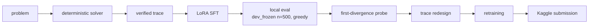
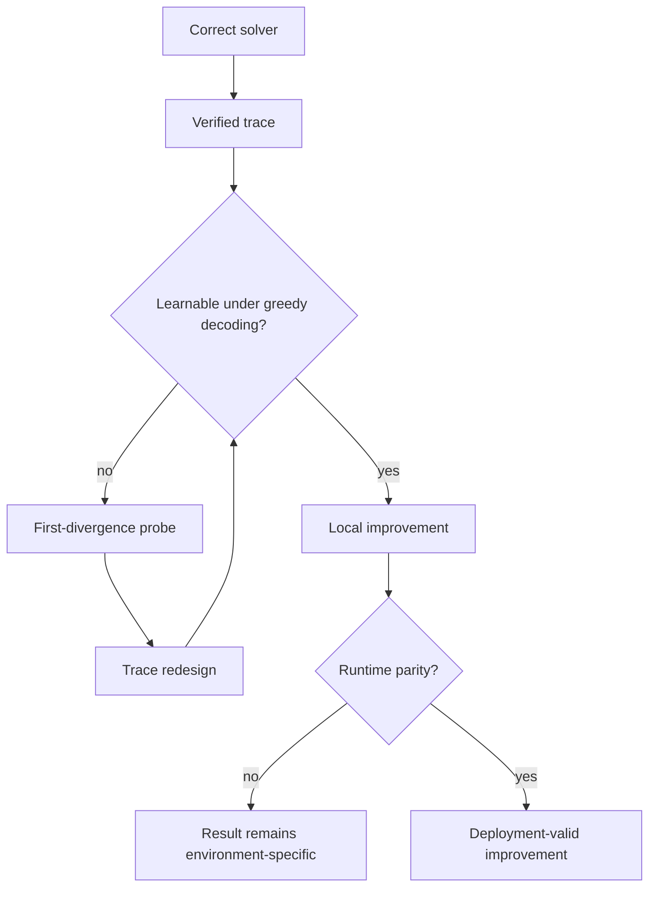

# The Three Ceilings: Trace Learnability and Runtime Drift in Deterministic Reasoning SFT

**Learnability Is Necessary, Not Sufficient — a retrospective on the NVIDIA Nemotron Model Reasoning Challenge** (Kaggle, closed June 15, 2026)

Public LB: 0.58 · Private LB (final): 0.604 · Rank: 3488/4182

---

## 1. Executive Summary

The project exposed three separate limits on deterministic reasoning SFT:

1. **Solver coverage:** can the data pipeline produce a correct, verified trace?
2. **Trace learnability:** can the model reproduce that trace token by token under greedy decoding?
3. **Runtime validity:** does the inference environment preserve the locally measured behavior?

The strongest experiment isolated the second limit. On `bit_manipulation`, solver coverage was 88.1% while baseline model accuracy was 33.3%. Teacher-forced first-divergence probing — adapted from tonghuikang's public work — showed that 44 of 47 examined failures first broke at the same rule-statement region. Rewriting the trace so that the rule was derived before it was declared raised local accuracy to **53.6%** (+20.3pp) without changing the solver.

That gain did not transfer to Kaggle: the redesigned adapter scored 0.56 public-LB against the 0.58 baseline. A later same-weights comparison found a roughly 25-point `text_encryption` accuracy swing across two local vLLM environments. The comparison establishes that runtime differences were material; the exact contribution of runtime to the Kaggle gap remains inferred rather than directly measured.

**Final result:** public LB 0.58 · private LB 0.604 · rank 3488/4182. The value of the project is the diagnostic loop and the corrected evidence trail: how to separate solver, trace-format, packaging, and runtime failures before treating a score movement as a model improvement.

---

## 2. System and Evaluation Overview

**Competition constraints.** Submission is a LoRA adapter, rank ≤ 32, for `nvidia/NVIDIA-Nemotron-3-Nano-30B-A3B-BF16` — a hybrid Mamba2/Mixture-of-Experts architecture with ~30 billion total parameters (the "A3B" suffix denotes its ~3B-class active-parameter count per token). Evaluation is greedy decoding across six reasoning categories; the leaderboard exposes only an overall score, never per-category accuracy. The winners finished around 0.92 on the private leaderboard; the 0.86–0.87 cluster we tracked during the competition was the public-LB pack.

**Pipeline.** Deterministic solvers produce verified traces per category; traces are formatted for SFT; the trained adapter is evaluated locally; failures are probed; trace formats are redesigned; the retrained adapter is packaged and submitted.



**Canonical local evaluation environment.** Spark 1 (NVIDIA DGX Spark, GB10), vLLM **0.20.1**, `dev_frozen` split (n=500, seed-42 stratified from Kaggle's `train.csv`), greedy decoding. Every local result uses this frame unless a different environment is named. Section 6 shows why that consistency matters.

**Score conventions.** Every per-submission Kaggle score quoted here (the 0.55–0.58 band) is a **public-LB** value unless labeled otherwise. The final private-LB result was 0.604 — the private split held slightly above the public one. The two are different metrics over different held-out splits, and a public-LB delta does not necessarily predict private standing. Local greedy evaluation carries a measured ±0.5pp run-to-run noise floor; we treat sub-1pp deltas as meaningless (the measurement behind that floor is documented in Appendix E).

**Experiment names used below.** The prose uses plain-language descriptions first; these labels are included for repository traceability.

| Name | What it is |
|---|---|
| v9 | Baseline adapter/dataset; `bit_manipulation` uses the compact "v4" trace format. The reference point. |
| v11 | v9 with *only* bit_manipulation retraced in the derivation-first "v5" format. |
| v12 | v11 + shortened v5 traces + a char-by-char text_encryption redesign (a deliberate two-variable step). |
| v13 | Shortened-v5 bit_manipulation + text_encryption reverted to v9's format. The submitted mix. |
| Adapter A | v9's weights packaged with experts padded to r32, `backbone` key prefix, and list-format `target_modules`. Best public-LB submission (0.58). |

---

## 3. The Three Ceilings

**Ceiling 1 — solver coverage:** does a correct, verified trace exist for the problem? This is a property of the data pipeline. It is the ceiling most competition effort targets, and the easiest to measure.

**Ceiling 2 — trace learnability:** can the model reproduce the trace token by token under greedy decoding? Under greedy decoding the model must commit to exactly one token at every position. If a token in the gold trace is not the argmax of the model's distribution — because nothing in the preceding context determines it — the trace diverges there, and the remainder is unrecoverable. Correctness of the trace is a prerequisite; **reproducibility under greedy decoding is the binding constraint**.

**Ceiling 3 — runtime validity:** does the inference environment preserve the behavior you measured? A locally verified gain is a claim about one runtime. §6 shows the same weights producing a ~25pp category-accuracy swing across two inference-engine versions.

Solver coverage measures whether the trace exists. Learnability measures whether the model can produce it. Runtime validity determines whether either measurement survives deployment.



The per-category evidence, from the canonical local eval of the v9 baseline (Kaggle provides no per-category output, so no leaderboard equivalent exists):

| Category | Solver coverage | v9 model accuracy (local) | Gap |
|---|---|---|---|
| gravitational_constant | n/a (model at 100%) | 100% | 0pp |
| numeral_conversion | n/a (model at 100%) | 100% | 0pp |
| unit_conversion | n/a (model at 100%) | 100% | 0pp |
| text_encryption | 100% (83/83) | 68.7% | ~31pp |
| bit_manipulation | 88.1% (74/84) | 33.3% | ~55pp |
| eq_transformation | 28.6% (24/84) | 15.5% | ~13pp |

Three categories are fully solved. `eq_transformation` is solver-bounded — coverage, not learnability, is the ceiling there. `bit_manipulation` shows a 55pp gap between what the data contains and what the model learns: a learnability problem, and the subject of §5. A separate artifact run showed `text_encryption` at 43.4%, but the runtime investigation in §6 showed that it was not comparable to the canonical frame. The supported baseline is 68.7%; only the `bit_manipulation` gap survives as a trace-learnability finding.

---

## 4. Diagnostic Method: Teacher-Forced First-Divergence Probing

The instrument is a single forward pass, used as a reusable procedure:

1. **Teacher-force** the gold trace through the model as the continuation of the prompt — one forward pass, no generation.
2. **Extract** per-token log-probabilities and ranks for every gold token.
3. **Locate the first divergence**: the first position where the gold token is no longer the model's argmax (rank > 1). Under greedy decoding, that position is exactly where generation will leave the trace.
4. **Aggregate** first-divergence positions across the failing examples of a category.
5. **Classify**: divergences clustered at a specific trace *region* indicate a format problem — fixable by redesigning the trace. Scattered divergences indicate a capacity or solver problem.

At the divergence points we observed, the gold token's log-probability sat between −0.7 and −2.3 — near-ties that the model resolves in favor of a different token.

The technique is not novel — we adopted it from tonghuikang's public work — but the way we applied it is worth naming clearly, because it distinguishes what we did from what he did:

- **Our usage:** post-hoc diagnostic. Run the probe on a failing category, identify the region where the model can't predict, redesign the trace format, retrain.
- **Huikang's usage:** continuous pre-submission gate. Run the probe after every training run, on every trace in the training set, and only submit when the worst traces cleared the threshold.

Huikang used the signal continuously as a pre-submission gate. We used it post hoc to diagnose one failing category, redesign the trace, and retrain. The reusable lesson is to move this probe earlier: run it after each training iteration, before spending a leaderboard submission.

---

## 5. Case Study: Bit Manipulation

The category asks the model to induce a bitwise transformation rule (operations like AND, OR, XOR, NOT, shifts, and composites) from example input→output pairs of 8-bit strings, then apply it to a test input.

**Baseline trace design.** Our v4 format used a compact rule statement, replacing a prior derivation-grid format (v3) that spent an 8-row per-bit verification grid deriving each bit before stating it. The v3→v4 change had shipped as an improvement: it cut trace length sharply (v4 traces max out at ~377 tokens) and eliminated truncation. Truncation had been the binding constraint until the traces got short enough to expose learnability as the next one.

**The divergence cluster.** Teacher-forced probing showed why v4 was worse than it looked: of 47 failures examined, 44 first diverged at the same region — the rule-statement tokens declaring the per-bit operator and operand indices. These tokens are not derivable from the preceding context. The model has no basis to predict *which* operator or *which* index comes next; the trace simply announces them.

The shipped generators show the difference. (The excerpts below are produced by the repository's own trace generators on a synthetic example, so that no competition data is quoted; the formats are identical to the shipped training traces.) The v4 format (`src/data/bit_manip_trace_v4.py`) declares the rule in one breath:

```
After trying candidate operations, the rule that matches every example is:
output[i] = input[i-1] XOR input[i+3] (zero-pad edges).
  check: rule(10100101) = 01111010 → expected 01111010 ✓
```

Nothing before that line forces `input[i-1]`, `XOR`, or `input[i+3]` — the highest-information tokens in the trace are the least determined. The v5 derivation-first format (same synthetic example, `src/data/bit_manip_trace_v5.py`) inverts the structure:

```
Bit 1: target O1=1101000110.
  No input column or its complement equals T, and T is not constant -> not unary.
  AND: no operand pair reproduces T.
  OR: no operand pair reproduces T.
  XOR: the partner is forced by Ij=T XOR Ii. Scan first operand:
    i=0: T XOR I0=0111001110 = I4 -> XOR(I0,I4)=1101000110=T. accepted.
  => out[1] = XOR(input[0], input[4]).
```

Every token in the final rule statement is preceded by the computation that produces it. The bit index, the operator, and the operand mapping are all derived from prior context before being stated. No token requires the model to guess.

**The result.** On the canonical local eval, `bit_manipulation` accuracy moved from **33.3% → 53.6%** (+20.3pp) with the v5 traces in v13, the submitted mix; the intermediate v12 mix reached 54.8% (+21.4pp). The solver did not change; only the trace format did.

**What this establishes — and what it does not.** It establishes that, on the canonical local environment, trace format was the binding constraint for this category within the rank-32 budget, and that first-divergence probing located the failure precisely enough for a format-only intervention to recover it. It does **not** establish transfer to Kaggle — the gain did not translate (§6) — nor that the redesign is beneficial under other runtimes, nor that it was free: the longer bit_manipulation traces cost `text_encryption` accuracy through cross-task interference in the shared adapter (§8, Appendix A).

---

## 6. Failure to Translate and the Runtime Investigation

**v9 versus v13 on Kaggle.** The v13 adapter — v9 with only bit_manipulation swapped to the shortened v5 traces, everything else byte-identical, packaged identically to Adapter A — scored **0.56** on the public LB. The v9 baseline scored **0.58**. A +20pp local category gain arrived as a leaderboard regression.

The leaderboard regression forced a broader parity check. The resulting evidence changed the interpretation: the local improvement was valid on its measured environment, but it was not a reliable predictor of behavior under a different inference stack.

**Principle: a local gain is only portable when the inference stack is comparable.**

**The same-weights comparison.** A parity check on `text_encryption` found that our canonical Spark 1 eval showed v9 at 68.7%, while a second run of the same v9 adapter showed 43.4%. Same weights (byte-identical, `cmp`-verified), same prompts, 0% truncation in both runs, same greedy settings. Twenty-six problems flipped between the two runs, with raw outputs starting identical and diverging mid-generation.

The 43.4% artifact does not record its engine version. Based on the machine and session trail, we attribute it to Spark 2 (vLLM 0.22.1), but that attribution is inferred rather than artifact-confirmed.

| Environment | vLLM version | text_encryption accuracy on v9 |
|---|---|---|
| Spark 1 (canonical) | 0.20.1 (confirmed from engine logs) | 68.7% |
| Spark 2 | 0.22.1 (attribution of the 43.4% run inferred — artifact records no version) | 43.4% |
| Kaggle | 0.17.1 (user-reported from a competitor notebook; not independently verifiable) | unknown (no per-category output) |

The ~25pp swing is a **local-vs-local** finding, on two machines we controlled, with identical weights — more than 50× the ±0.5pp noise floor we had measured for greedy decoding on 0.20.1 (Appendix E). Long traces (text_encryption's typical output shape) appear to amplify kernel-level greedy divergence into large accuracy swings. Kaggle's reported 0.17.1 is a third, unreproduced environment.

**The implication for the bit_manipulation result.** Our +20.3pp local gain was measured on Spark 1 (vLLM 0.20.1). Kaggle reportedly runs vLLM 0.17.1. **We have no way to know what the same weights would have scored under Kaggle's runtime**, and the Nemotron–DGX-Spark hardware combination cannot run vLLM 0.17.1 (CUDA driver requirements). The runtime is a structural constraint of the competition, not something we could have engineered around locally.

**Precision about the claim.** vLLM version divergence is *a* dominant contributor to the local-vs-Kaggle gap, not the sole cause. Packaging (§7, §8), stage-2 recipe differences, and other factors also contribute. Even fully applied, the best submission's public-LB 0.58 against the local overall 0.694 leaves an ≈11pp residual that we attribute — inferred, not confirmed — to the same runtime-version divergence the two local rows demonstrate directly. What the same-weights swing establishes is simple: runtime was material enough to overwhelm ordinary adapter-level deltas. A local optimization should therefore be treated as environment-specific until tested under deployment parity.

---

## 7. Findings That Survived Scrutiny

- **Trace learnability is a distinct ceiling.** A category can have 88.1% solver coverage and 33.3% model accuracy. Solver coverage measures whether the data exists; learnability measures whether the model can reproduce it (§3, §5).
- **First-divergence probing locates format-level failures.** 44 of 47 examined failures diverged at one structural region — precise enough to design a targeted intervention (§4, §5).
- **Derivation-first traces improved local bit_manipulation accuracy.** 33.3% → 53.6% with no solver change, on the canonical local environment only (§5).
- **Runtime version materially affects generated results.** ~25pp same-weights swing across two local vLLM versions, subject to the Spark 2 attribution caveat (§6). Read the other way, this finding validates the competition's choice of a standardized G4/RTX PRO 6000 evaluation infrastructure — Google Cloud G4 VMs with NVIDIA RTX PRO 6000 Blackwell GPUs, per NVIDIA's retrospective ["Lessons From the Leaderboard"](https://developer.nvidia.com/blog/lessons-from-the-leaderboard-what-5000-kagglers-taught-us-about-improving-ai-reasoning): when byte-identical weights can swing this much across inference stacks, a single fixed runtime is what keeps leaderboard scores comparable across entrants at all.
- **List-format `target_modules` was the reproducible Kaggle packaging lever.** On byte-identical weights, converting `target_modules` from a regex string to an explicit list produced a clean ~2pp public-LB gain (0.55 → 0.57). The proposed mechanism — vLLM 0.17.1 silently under-applying a regex `target_modules` — is inferred, not confirmed on 0.17.1 locally. Both this lever and the finding below are specific to vLLM 0.17.1 and may or may not matter on newer versions; and like every packaging A/B in this writeup, the deltas are public-LB values that do not necessarily predict private standing.
- **Backbone-prefix renaming was not a reproducible lever.** The difference between `model.model.` and `backbone.` key prefixes is ≤1pp and sign-inconsistent across A/Bs — noise at our submission-level floor.

---

## 8. Confounds and Corrected Interpretations

Three prominent interpretations failed a later single-variable check. The useful outcome is not the reversal itself, but the narrower conclusion that survived it.

| Initial interpretation | Confound discovered | Supported conclusion |
|---|---|---|
| **"Load-bearing bug":** fixing the MoE converter's transposed expert-B reshape dropped the public LB from ~0.58 to 0.55, so the scrambled deltas must have been helping (accidental regularization) | The B-buggy and B-fixed submissions also differed in `target_modules` format (regex vs list); regex-mode silently causes partial LoRA application on vLLM 0.17.1 — the A/B was measuring packaging, not the reshape | The reshape fix is mathematically correct (round-trip verified; Appendix B). **Its true Kaggle effect through correct packaging remains untested.** |
| **"text_encryption learnability wall":** on a 43.4% eval frame the model appeared to build a correct cipher map and then ignore it, generating fluent English instead of mechanical substitution; a char-by-char trace redesign was adopted to structurally prevent this | The motivating 43.4% was itself the runtime artifact of §6 — the canonical baseline was already 68.7%, close to the solver-coverage ceiling. The redesign also shipped bundled with a bit_manipulation trace change (a deliberate two-variable step), so its effect was never isolated | There was no learnability wall to break through. The drop from 68.7% was mostly cross-task interference from the longer bit_manipulation traces: 68.7 (v9) → 56.6 (v11, bit_manip-only change) → 53.0 (v12, two-variable) → 54.2 (v13, char-by-char reverted — did not recover). At most ~3.6pp is isolable to the char-by-char redesign. |
| **"Backbone prefix is load-bearing":** a submission with renamed key prefixes scored 0.55 vs 0.58 on byte-identical weights (max-abs-diff 0.0) | That submission changed two fields, not one: the key prefix *and* the `target_modules` format | A clean prefix-only A/B (byte-identical weights, only the prefix renamed, per-tensor SHA verified) shows the prefix is neutral-to-slightly-negative — noise. The lever is the list format (§7). |

Two details from these episodes are worth keeping in view. First, the char-by-char cipher-decode trace design in the second row follows tonghuikang's design — his reference reasoner emits a per-character `cipher→plain` lookup step immediately before each decoded word. The design was sound; the problem it was aimed at did not exist on the canonical frame. Second, the forensic observations that motivated that redesign (misses landing exactly one plausible English word off; the model's own cipher map never matching its emitted output) were real observations — of the *artifact eval run's* failure mode, not of a live learnability wall. The full forensic record, with its evidentiary caveats, is preserved in Appendix A.

Across all three cases, the same rule held: score movement was not evidence of mechanism until the changed variables were isolated.

---

## 9. Practical Recommendations

For anyone running SFT on solver-generated traces under deterministic decoding:

- **Measure solver coverage and model accuracy separately.** They are different ceilings; a gap between them is a learnability signal, not a data-volume signal (§3).
- **Probe first-divergence positions before scaling data.** One forward pass per trace tells you *where* greedy decoding will break, and whether failures cluster (format — cheap fix) or scatter (capacity) (§4).
- **Derive consequential tokens before declaring them.** A trace token the model cannot predict from prior context is a divergence point waiting to happen. Restructure so high-information tokens are computed in-trace before being stated (§5).
- **Record the inference-engine version in every evaluation artifact.** The single most consequential missing field in our own artifacts — it turned a clean runtime comparison into an inferred attribution (§6).
- **Store raw generations, not only aggregate scores.** The mid-generation divergence pattern (identical prefixes, then a flip) was only visible because raw outputs were kept (§6).
- **Change one experimental variable at a time — and audit past experiments against the same standard.** All three confounds in §8 were two-variable experiments wearing single-variable conclusions.
- **Treat local gains as environment-specific until tested under deployment parity.** A +20pp local gain arrived on the leaderboard as a regression (§6). Pin the runtime version before trusting any local→production extrapolation; if you cannot run the production runtime locally, treat the gap as unmeasurable rather than assuming it away.
- **Consider separating reusable knowledge from new problem-solving.** Our traces re-derive everything per problem; distilling the stable, reusable parts (operator semantics, cipher mechanics, transformation rules) into the adapter separately from problem-specific derivation is a lever this project did not explore, and we cannot say whether it would have moved the learnability ceiling.

---

## 10. Reproducibility

**Repository:** `github.com/kpeterson1/nemotron-reasoning` (public with this writeup)

**Repository state:** The public repository is a snapshot of the final tree containing the code, traces, and diagnostics behind the 0.58 public-LB / 0.604 private-LB result. Some branch-level investigation history remains private; the supported conclusions and reproducible artifacts are documented in §6–§8 and `docs/investigations/`.

**Key scripts:**
- `src/training/convert_peft_to_vllm_moe.py` — MoE adapter conversion pipeline. The shipped version applies the correct `(out, E, r)` expert-tensor reshape; the earlier transposed-reshape bug and its correction are described in §8 and Appendix B.
- `src/data/` — per-category deterministic solvers and trace generators (the v4 and v5 bit_manipulation formats of §5 are `bit_manip_trace_v4.py` and `bit_manip_trace_v5.py`)
- `src/data/split.py` — regenerates the evaluation splits (dev_frozen n=500, seed-42 stratified) from Kaggle's `train.csv`; competition data is not redistributed with this repository (see `datasets/splits/README.md`)
- `src/evaluation/run_eval.py` — vLLM inference harness (greedy, max_tokens=7680, max_model_len=8192)
- `scripts/bitmanip_logprob_probe.py`, `scripts/text_enc_logprob_probe_vllm.py` — teacher-forced logprob probes

**Evaluation parameters (matching Kaggle runtime as closely as possible):**

| Parameter | Value |
|---|---|
| max_lora_rank | 32 |
| max_tokens | 7680 |
| top_p | 1.0 |
| temperature | 0.0 |
| max_model_len | 8192 |

**Compute:** Two NVIDIA DGX Spark nodes (GB10 Grace Blackwell, 128 GB unified memory). Spark 1 ran vLLM 0.20.1 (canonical local eval); Spark 2 ran vLLM 0.22.1 (used to surface the runtime finding of §6). Neither can run vLLM 0.17.1 due to CUDA driver requirements — Kaggle-runtime reproduction was not possible on our hardware.

**Session logs and corrections log:** `docs/investigations/` and `docs/SESSION_LOG.md` preserve the trail of findings, reversals, and single-variable ablations described in this writeup. Internal correction labels (C2, C7, …) used throughout those documents are indexed in Appendix D.

**Acknowledgments:** tonghuikang's public writeup and midpoint Open Prize–winning repository were the structural benchmark for this work. The min-logprob diagnostic technique and the character-by-character cipher decode are his contributions; our application of them to diagnose format-level learnability and — separately — to name our own confounds is original, though we adopted the technique too late to close the loop before the deadline. The first-place team's writeup is cited in `references/README.md` as corroboration of the evaluation parameters. Provenance for the reference copies of tonghuikang's implementation we worked from is documented in `references/README.md`.

---

## Appendix A: text_encryption forensic record

The forensic detail behind the discarded diagnosis of §8 — gathered before the runtime investigation explained it — is preserved here because the observations were real even though the conclusion drawn from them was not. (These counts come from an uncommitted, contemporaneous CPU analysis; no committed artifact backs them, though the arithmetic reconciles with the run: 43.4% = 36/83 correct, leaving 47 misses.)

Decomposing the 47 misses of the artifact eval run: 26 of 47 differed from the gold answer by exactly one plausible English word (`treasure` decrypted as `studies`, `dreams` as `reads`, `curious` as `crystal` — cryptographically wrong, defensible as English continuations). For 0 of 47 misses did the emitted plaintext equal the result of mechanically applying the model's own cipher map; on correct predictions, the mechanical-map match held 81% of the time (29/36). Solver coverage for the category was 100% (83/83), with traces of at most 536 tokens (min 384 / median 470; re-audited 2026-07-09 via `scripts/audit_solver_coverage.py --tasks text_encryption`, CPU-only) — so the gap could not be blamed on data.

What these numbers actually characterize is the failure mode of the **artifact eval run** (Spark 2 / vLLM 0.22.1 by inference — §6): how that runtime's divergences look when they land (one plausible English word off), not a live learnability wall in the trained model.

## Appendix B: MoE converter tensor mechanics

PEFT stores the routed-expert LoRA weights as packed 3D `nn.Parameter` tensors — `lora_A`: `(num_experts, rank, in_features)`, `lora_B`: `(out_features, num_experts, rank)` — which the converter must unpack into per-expert 2D matrices for vLLM. The original converter reshaped `lora_B` assuming `(out, r, E)` packing where the actual packing is `(out, E, r)`, scrambling per-expert deltas across all 23 MoE layers × 128 experts. A two-character fix corrected it. A correct conversion produces **12,008 tensors** from the adapter; we validated this count and spot-checked individual expert deltas via round-trip extraction (`scripts/check_expert_unpack_roundtrip.py`) after every conversion. As §8 records, the fix's isolated Kaggle effect remains untested — the submission that carried it also changed `target_modules` format.

## Appendix C: Adapter and submission chronology

The full packaging ladder — every Kaggle submission with its expert-rank state, `target_modules` format, key prefix, and public-LB score — is maintained in [`RESULTS.md`](../RESULTS.md), which is the canonical record. Named submissions referenced in investigation documents: **Adapter A** (v9 weights, r32-padded experts, backbone prefix, list `target_modules` — best public LB, 0.58), **the squeeze** (Adapter A's weights with `model.model` prefix + regex `target_modules` — 0.55, the two-variable submission of §8), **B_FIXED** (rebuilt with the corrected expert-B reshape — 0.55, also regex/`model.model`, hence the untested reshape effect). v13 was additionally submitted once via naive packaging (mixed-rank experts, undeclared), scoring 0.55 — a packaging confound distinct from its A-packaged 0.56.

## Appendix D: Correction-label index

`RESULTS.md`, `docs/SESSION_LOG.md`, and `docs/investigations/OPEN_QUESTIONS.md` cross-reference internal correction labels. This index maps them to the sections of this writeup that carry their content; full correction text lives in [`docs/investigations/OPEN_QUESTIONS.md`](investigations/OPEN_QUESTIONS.md) (corrections C1–C11).

| Label | One-line content | In this writeup |
|---|---|---|
| C2 | The converter's expert-B reshape was transposed — a real bug, fixed and round-trip verified | §8 (row 1), Appendix B |
| C5 | ±0.5pp greedy run-to-run noise floor; sub-1pp deltas are not meaningful | §2, Appendix E |
| C7 | The same adapter scores differently across vLLM versions; Kaggle's reported version differs from both local hosts | §6 |
| C8 | v13's naive-packaged 0.55 was a packaging confound, not a trace regression | Appendix C |
| C9 | The "squeeze" 3pp drop changed two fields; a prefix-only A/B shows the prefix ≈ neutral | §8 (row 3) |
| C10 | `target_modules` must be a list — the load-bearing packaging lever; the prefix is noise | §7 |
| C11 | Reconciles C2 with C8/C10: the reshape fix is correct but its Kaggle effect is untested | §8 (row 1) |

## Appendix E: The greedy non-determinism measurement behind the ±0.5pp noise floor

vLLM 0.20.1 greedy decoding (`temperature=0.0`) is not strictly deterministic across `(max_num_seqs, max_model_len)` permutations on this architecture. Observed 2026-05-26: 12 of 500 rows (≈2.4%) produced different text on the same prompts, seeds, and adapter under a config-only delta (`max_num_seqs` 32→64, `max_model_len` 4096→8192). The cause is fp32 reduction-order changes in the fused MoE / attention kernels as KV-cache page layout and batch scheduling shift. Per-row flips are single-bit-edit style — the model lands on a different token at a near-tie logit boundary, then the divergence cascades.

This measurement is the basis of the expected ±0.5pp submission-level noise floor (correction C5) used throughout this writeup: any single-submission delta below 1pp is treated as statistically meaningless, and a finding that hinges on a sub-1pp delta calls for a repeat under a different seed/config, or a larger split, before it is trusted. §6 documents the corresponding cross-version behavior, where long output traces amplify kernel-level greedy divergence into much larger accuracy swings.
